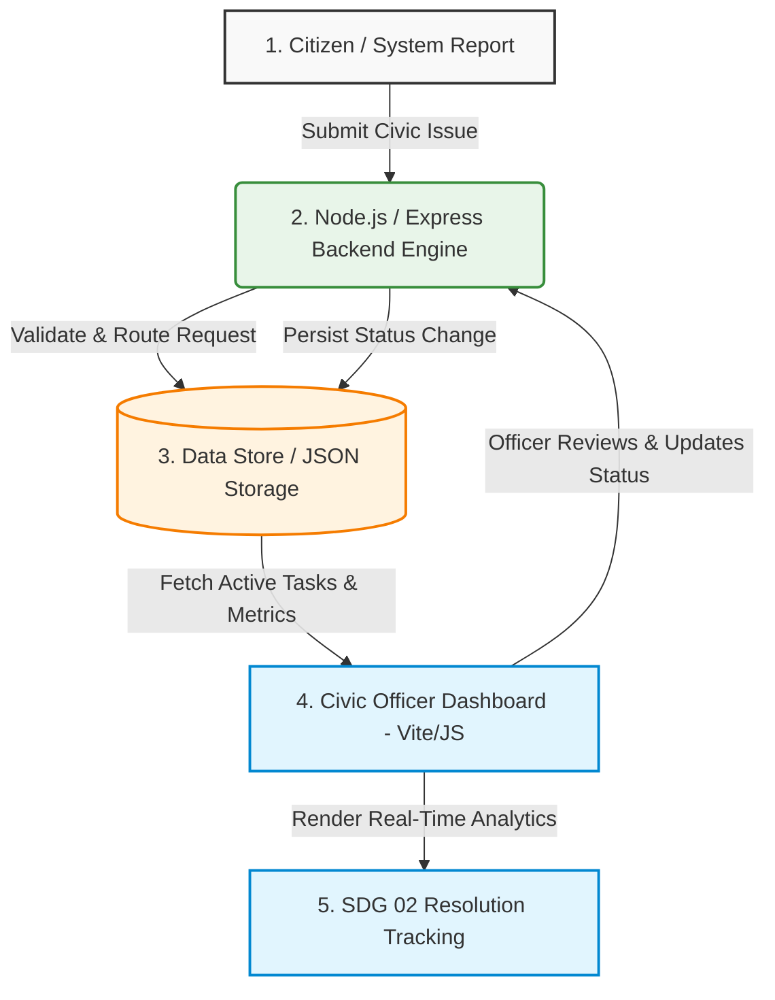

# CodeRush 2.0 | Coffee Overflow

## Project Information

* **Team Name:** Coffee Overflow
* **Project Title:** NAGRIK AI - Community Redressal system
* **Track/Theme:** SDG 

## Project Description

Urban management and municipal governance often suffer from fragmented reporting channels, causing delays in resolving critical public issues. This project provides a real-time, unified platform featuring a dedicated Civic Officer Dashboard and a scalable backend API. It enables municipal authorities to efficiently monitor, process, and resolve civic complaints while tracking resource allocation aligned with sustainable development goals.

## Technical Stack

* **Frontend:** Vite, HTML5, CSS3, JavaScript (ES6+), Oxlint
* **Backend:** Node.js, Express (`server.js`)
* **Database:** File-based / JSON Data Store
* **Tools/APIs:** Git, GitHub, npm, RESTful APIs

## Setup and Installation

1. Clone the repository:
   ```bash
   git clone [https://github.com/prernaajaypatil-oss/CodeRush-2.0---Coffee-Overflow.git](https://github.com/prernaajaypatil-oss/CodeRush-2.0---Coffee-Overflow.git)
   cd CodeRush-2.0---Coffee-Overflow
2. Install dependencies:

Bash
# Install backend dependencies
cd backend
npm install

# Install frontend dependencies
cd ../civic-officer-dashboard
npm install
Configure environment variables (provide a .env.example if necessary):

Bash
# Create a .env file in the backend directory if required
PORT=5000
Start the development server:

Bash
# Start backend API server (from backend/ directory)
node server.js

# Start frontend dashboard (from civic-officer-dashboard/ directory)
npm run dev

---

### How to update this on GitHub

Run the following commands in your PowerShell terminal to commit and push this exact template:

```powershell
git add README.md
git commit -m "docs: update README to match CodeRush 2.0 official template"
git push origin main
````
## 🔄 Application Workflow



### 📋 Workflow Breakdown

1. **Issue Ingestion:** Citizens or automated logging systems send civic issue payloads (location, severity, details) to the backend.
2. **API Processing:** The Node.js (`server.js`) API validates input data, categorizes the task, and assigns priority levels.
3. **Data Persistence:** Reports and operational metrics are saved to the persistent data store.
4. **Officer Operations:** Administrative officers access the Vite-powered **Civic Officer Dashboard** to view active tickets, assign teams, and resolve complaints.
5. **Impact Tracking:** Real-time data feed updates high-level metrics targeting resource distribution and SDG 02 goals.
# 👥 Team

**Coffee Overflow**

- Prerna Patil (Team Leader)
- Oshin Moon
- Srushti Shahade
- Sharwari Dhandale
- Shruti Bawankule

---

# 📜 License

This project is developed as part of a Hackathon under the **SDG Track** and is intended for educational and demonstration purposes.

